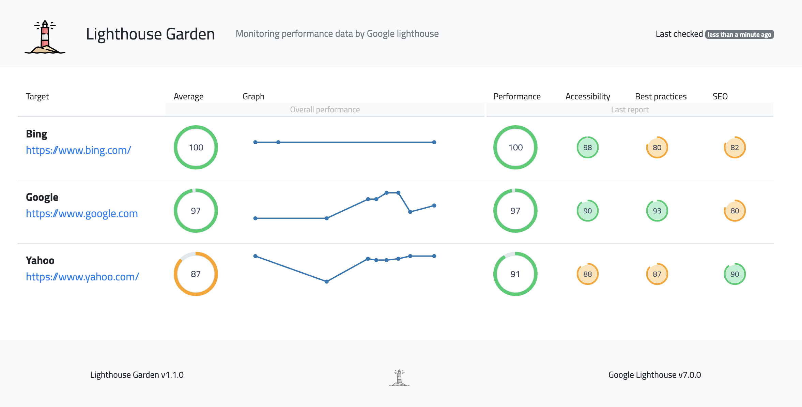
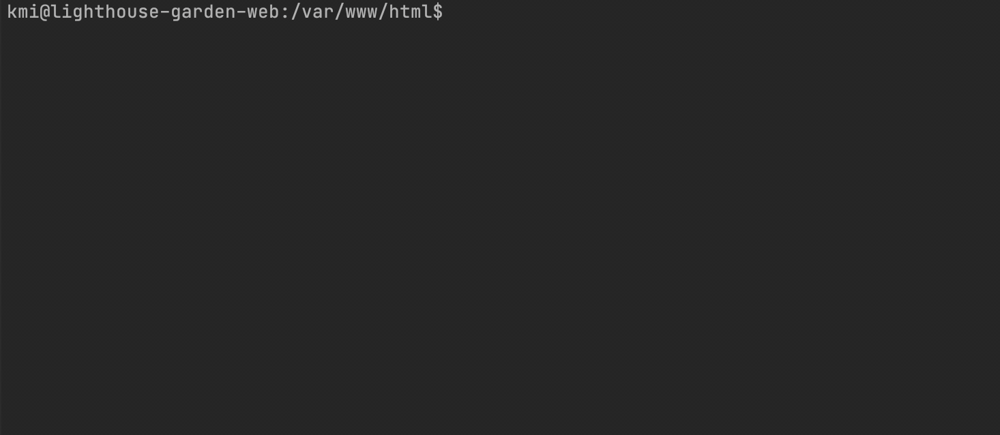

<h1 align="center">Lighthouse Garden</h1>

<p align="center">
</p>


[](https://scrutinizer-ci.com/g/jackd248/db-sync-tool/?branch=master)
[](https://scrutinizer-ci.com/g/jackd248/db-sync-tool/build-status/master)


Aggregate a performance overview for various target pages using the [Google Lighthouse](https://github.com/GoogleChrome/lighthouse) service. 



## Features

- Track multiple target pages
- Lighthouse audits for performance, accessibility, best practices and SEO
- Average performance data
- History performance graph with stored lighthouse reports
- Informational badges: 


## Installation

### Prerequisite

The script needs [python](https://python.org/) __3.5__ or higher. It is necessary for some additional functionalities to have [pip](https://pypi.org/project/pip/) installed on your local machine. 

<a name="install-pip"></a>
### pip
The library can be installed from [PyPI](https://pypi.org/project/lighthouse-garden-kmi):
```bash
$ pip3 install lighthouse-garden-kmi
```

### Configuration

The configuration file contains important information about the script processing and target pages.

```json
{
    "export_path": "path/to/export/",
    "keep_history": 10,
    "targets": [
        {
            "title": "Google",
            "identifier": "google",
            "url": "https://www.google.com"
        }
    ]
}
```

## Usage

Run the python script via command line.

```bash
$ python3 lighthouse_garden
```

```bash
usage: lighthouse_garden [-h] [-v] [-c CONFIG] [--clear]

Monitoring performance data by lighthouse.

optional arguments:
  -h, --help            show this help message and exit
  -v, --verbose         Enable extended console output
  -c CONFIG, --config CONFIG
                        Path to config file
  --clear               Clear all performance data and reset the application
```



### Cronjob

Register optionally a cronjob for regularly updates

```bash
0 5 * * * python3 lighthouse_garden -c /var/www/html/config.json
```

## Test

Run the script within the [DDEV](https://www.ddev.com/) container:

```bash
$ ddev start
$ ddev ssh
/var/www/html$ pip3 install -r requirements.txt
/var/www/html$ python3 lighthouse_garden -c tests/config.json
```

Open `http://lighthouse-garden.ddev.site/`

## Build

The packaging process of the python module is described on [python.org](https://packaging.python.org/tutorials/packaging-projects/).

## Credits

- Performance analysis by [lighthouse](https://github.com/GoogleChrome/lighthouse)
- Graph visualization by [plot.ly](https://plot.ly/javascript/)
- Icon made by [freepik](https://www.flaticon.com/authors/freepik)